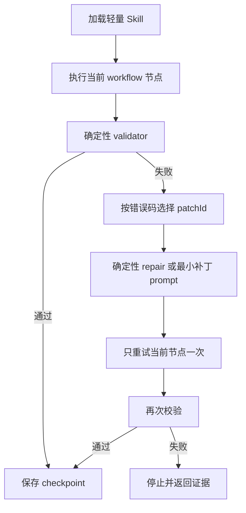

# OpenYida Skill 最新治理执行方案

> 版本：v2  
> 日期：2026-08-09  
> 状态：治理与实施方案，不代表代码已经实现  
> 适用范围：`yida-skills/`、`lib/core/command-manifest.js`、`lib/app/`、`scripts/eval/`、Skill 发布包  
> 本方案是独立完整文件，不要求读者先阅读上一版治理文档。

## 1. 方案结论

本轮新增的四条建议全部采纳，并作为核心 Skill 收敛的直接执行要求：

1. 根 `openyida/SKILL.md` 只负责全局预检、完整应用/单点任务分流和子 Skill 路由，不再保存完整应用流程摘要版。
2. `yida-app/SKILL.md` 只保留一份详细流程，即“完整应用统一编排阶段”；设计职责、标准执行流、UI/体验集成点都压成短引用。
3. `yida-app` 只保留 PRD、design.md、page-spec 三者关系，不保存 page-spec 字段清单、页面生成器修复策略和源码规范。
4. `yida-design` 是 `prd.md` 与 `design.md` 的唯一产物 owner；其他 Skill 只引用，不重新解释两份文件各自写什么。
5. `yida-canvas-custom-page` 是 Code Canvas 页面实现规则 owner；page-spec 生成、数据绑定、主题落地、组件、源码修复和编译规则归它或它调用的确定性脚本。
6. 新自定义页面默认只走 Code Canvas。`yida-custom-page` 保留，但只服务用户明确要求普通 JSX/Jsx、维护历史页面或使用 Canvas 当前确实不具备的实例能力。
7. `this.utils.yida` 的 7 个表单方法和 6 个流程方法由发布 Schema 自动注册到统一 window runtime；主题注入也由同一 runtime 提供。
8. 自适应补丁是后续可选阶段，不进入第一批治理。只有三个核心入口完成去重并取得路由、速度和质量基线后，才评估是否需要建设 patch registry 和自动重试。
9. OpenYida 只提供一份完整 `canvas.canvas.jsx` 脚手架。13 个 Yida API、主题、表单提交/详情抽屉、URL 构造、实例 ID 校验、iframe 主题同步和基础状态全部预置，不按官网、看板、列表、表单等场景裁剪。
10. 创建宜搭原生表单使用独立的表单创建脚手架，不把它误写成自定义页面 JSX。Agent 只扩展 `.form.json` 中的字段、分组、校验和规则；OpenYida 用唯一 `form-schema-builder.js` 与 `form-runtime.js` 生成原生表单 Schema、生命周期、主题和 formDetail 样式。

第一批只修改以下三个源码 Skill：

1. `yida-skills/SKILL.md`。
2. `yida-skills/skills/yida-app/SKILL.md`。
3. `yida-skills/skills/yida-design/SKILL.md`。

第一批不实现补丁制度、不新增 patch registry、不改 Canvas runtime、不做 API/主题注入、不创建脚手架、不治理其他 Skill。目标只是把重复职责删掉：能用一句 owner 引用说明的内容，就不再保留摘要版、流程副本或实现细节。

治理重点不是单纯删字，而是建立四层结构：

| 层 | 负责内容 | 不负责内容 |
| --- | --- | --- |
| 路由层 | 判断任务类型并加载唯一入口 | 不展开完整应用步骤，不复制领域规则 |
| 编排层 | 阶段、状态、依赖、checkpoint、doneWhen | 不写设计细节，不写页面源码规范 |
| 领域层 | PRD、设计、表单、流程、数据、页面等领域事实 | 不维护 CLI 参数全集，不复制其他领域规则 |
| 确定性执行层 | CLI、Schema、runtime、validator、readback、patch executor | 不依赖模型手写桥、注入和参数修复代码 |

## 2. 当前基线与问题证据

### 2.1 当前规模

| 对象 | 数量 | 当前事实源 |
| --- | ---: | --- |
| 根 Skill | 1 | `yida-skills/SKILL.md` |
| 子 Skill | 52 | `yida-skills/skills/**/SKILL.md` |
| Skill 入口合计 | 53 | 根入口 + 子 Skill |
| 共享 reference | 11 | `yida-skills/references/*.md` |
| Skill 专属 reference | 83 | `yida-skills/skills/*/references/**/*.md` |
| reference 合计 | 94 | 共享 + 专属 |
| workflow/template Markdown | 9 | `yida-design/workflow/*.md`、connector template |
| Markdown 总量 | 156 | `yida-skills/**/*.md` |
| CLI manifest entry | 101 | `lib/core/command-manifest.js` |

### 2.2 四个核心入口当前体积

| 文件 | 当前行数 | 主要问题 |
| --- | ---: | --- |
| `yida-skills/SKILL.md` | 288 | 根入口在路由后又展开完整应用资源顺序、schema、Canvas、seed、导航和最终输出 |
| `yida-app/SKILL.md` | 329 | 同一流程在职责边界、标准执行流、UI 集成点、页面规格、统一编排阶段中多次出现 |
| `yida-design/SKILL.md` | 98 | 已具备产物 owner 基础，但仍混入部分实现 API、URL、抽屉、主题注入细节 |
| `yida-canvas-custom-page/SKILL.md` | 161 | 应作为实现 owner，但仍重复解释 PRD/design 产物语义，并要求模型复制部分 runtime helper |

四个文件中同时出现 `prd.md`、`design.md` 或 `page-spec.json` 关系说明的匹配点共有 57 处。重复不仅增加 token，还会导致一处更新后其他位置继续给出旧判断。

### 2.3 对新增建议的逐条判断

| 建议 | 判断 | 当前证据 | 最终处理 |
| --- | --- | --- | --- |
| 根 Skill 删除“完整应用默认链路”展开 | 接受 | 当前根入口第 136-155 行重复 yida-app 的资源顺序、seed、schema、Canvas、导航和 final | 替换为 3 条短引用，详细内容全部由 yida-app 持有 |
| yida-app 只保留一份详细流程 | 接受 | 当前第 46-58、69-104、106-122、187-200 行均在描述同一编排 | 以“完整应用统一编排阶段”为唯一详细 stage table，其余章节压缩为引用 |
| yida-app 压缩“页面规格优先” | 接受 | 当前第 141-185 行列出 page-spec 字段、修复矩阵、生成器和 JSX 安全规则 | yida-app 只保留四句事实源关系，细节迁到 Canvas Skill、validator 和生成器 contract |
| PRD/design 职责只在 yida-design 展开 | 接受 | yida-design 已明确输出两份文件且不写源码 | yida-design 独占产物 schema、字段语义和质量门禁；其他入口只写 owner pointer |

### 2.4 不能直接删除的内容

以下内容的 owner 原文或安全实现不能直接删除。第一步可以删除它们在根入口、`yida-app`、`yida-design` 中的副本，并改成一句话引用，但不能同时删除被引用 owner 中的完整规则：

| 内容 | 删除前必须具备 |
| --- | --- |
| Canvas 中调用宜搭表单/流程 API | 13 个方法已经稳定注册到统一 window runtime |
| 主题注入 helper | Schema Builder 已自动注入 theme runtime，重复执行幂等 |
| page-spec 字段和修复矩阵 | page-spec Schema、validator、错误码和生成器文档已就绪 |
| schema 获取与字段解析提示 | CLI 已输出 compact resolved/candidates，字段解析 validator 可用 |
| publish 完成纪律 | publish guard 已提供 target、revision、readback 和证据 |
| 弱模型格式补丁 | 第一批不改、不迁移、不建设新制度；先只删除三个入口中的重复说明，补丁是否脚本化留到后续评估 |

## 3. 唯一规则所有者

### 3.1 核心所有权表

| 规则或产物 | 唯一 owner | 其他位置允许写什么 | 其他位置禁止写什么 |
| --- | --- | --- | --- |
| 全局预检与任务分流 | 根 `openyida` | 一句触发和子 Skill 名 | 领域执行步骤、资源顺序、实现规则 |
| 完整应用阶段和 checkpoint | `yida-app` | 引用阶段 ID | 重新展开完整流程 |
| `prd.md` 业务事实 | `yida-design` | “消费 yida-design 产出的 prd.md” | 重复列 PRD 字段和质量规则 |
| `design.md` 视觉事实 | `yida-design` | “消费 yida-design 产出的 design.md” | 重复列 token、布局、材质、圆角和状态字段 |
| `page-spec.json` 派生规则 | `yida-canvas-custom-page` + page-spec validator | “需要生成器时派生 page-spec” | 在 yida-app 中维护字段全集和修复矩阵 |
| Code Canvas 实现 | `yida-canvas-custom-page` | “默认进入 Canvas 实现节点” | 根 Skill/yida-app 复制代码规范 |
| 普通 JSX/Jsx 实现 | `yida-custom-page` | 明确 legacy/native 触发条件 | 作为新页面并列默认方案 |
| 13 个 Yida 数据 API | `yida-api.manifest` + Canvas runtime | 引用 runtime ready contract | 模型复制代理方法 |
| 主题 runtime | Canvas runtime | 引用 `runtime.theme` | 模型复制 style 注入 helper |
| Canvas 页面脚手架 | `yida-canvas-custom-page` + `lib/samples/yida-canvas-custom-page/canvas.canvas.jsx` | 从完整脚手架增加业务组件和字段映射 | 按场景删减 API、主题、抽屉和高频 helper |
| 原生表单创建脚手架 | `yida-create-form-page` + form schema builder | 扩展字段、分组、校验、规则和数据源定义 | 把原生表单误建成 Canvas/普通自定义页，或让模型手写完整 Schema 生命周期 |
| CLI 命令、参数、副作用、权限 | command manifest | 引用 command ID | Skill 手抄完整参数表 |
| 资源 URL | link builder / field-and-url contract | 引用结构化结果 | 模型手拼 URL |
| 最终业务输出 | workflow final node | 引用 doneWhen | 根入口和多个子 Skill 分别维护格式 |
| 补丁（仅后续可选） | patch registry | 引用 patchId | 把弱模型补丁写进默认 Skill 正文 |

### 3.2 一条规则只出现一次的执行标准

每条跨 Skill 规则必须分配稳定 `ruleId`。owner 保存完整规则，消费者只保存以下三项：

```yaml
ruleRef: APP.DESIGN.SOURCE_OF_TRUTH
owner: yida-design
when: 完整应用或页面实现需要业务与视觉输入
```

重复检测不只比较文本相似度，还要检查：

1. 同一个 `ruleId` 是否有多个 owner。
2. 同一 command ID 是否在多个 Skill 中维护参数说明。
3. 同一 API 方法是否在 reference、Skill 和 helper 中维护三份签名。
4. 同一 workflow 阶段是否在根入口和 yida-app 同时展开。
5. 同一产物字段是否在 yida-design、yida-app 和 Canvas Skill 同时定义。

## 4. 目标目录结构

```text
yida-skills/
├── SKILL.md
├── references/
│   ├── setup-and-env.md
│   ├── development-rules.md
│   ├── field-and-url-reference.md
│   └── ...
└── skills/
    ├── yida-app/
    │   ├── SKILL.md
    │   ├── workflow/
    │   │   ├── 00-resolve-context.md
    │   │   ├── 01-design.md
    │   │   ├── 02-app-resources.md
    │   │   ├── 03-forms-processes.md
    │   │   ├── 04-seed-data.md
    │   │   ├── 05-page-delivery.md
    │   │   ├── 06-publish-navigation.md
    │   │   └── 07-final-output.md
    │   ├── contracts/
    │   │   ├── app-workflow-state.schema.json
    │   │   └── app-checkpoint.schema.json
    │   └── references/
    │       └── app-build-contract.md
    ├── yida-design/
    │   ├── SKILL.md
    │   ├── workflow/
    │   ├── contracts/
    │   │   ├── prd.schema.json
    │   │   └── design.schema.json
    │   └── references/
    ├── yida-canvas-custom-page/
    │   ├── SKILL.md
    │   ├── contracts/
    │   │   ├── page-spec.schema.json
    │   │   └── canvas-runtime.schema.json
    │   ├── scripts/
    │   │   ├── derive-page-spec.js
    │   │   ├── validate-page-spec.js
    │   │   └── validate-canvas-result.js
    │   └── references/
    ├── yida-create-form-page/
    │   ├── SKILL.md
    │   ├── contracts/
    │   │   └── form-definition.schema.json
    │   └── references/
    └── yida-custom-page/
        ├── SKILL.md
        └── references/

lib/app/runtime/
├── canvas-runtime.js
├── canvas-yida-api-methods.js
├── canvas-theme-runtime.js
└── canvas-runtime-errors.js

lib/app/scaffolds/
├── canvas/
│   └── canvas-scaffold.js
└── form/
    ├── form-schema-builder.js
    ├── form-runtime.js
    └── form-definition-schema.json

lib/samples/
├── yida-canvas-custom-page/
│   └── canvas.canvas.jsx
└── yida-create-form-page/
    └── form.form.json

scripts/eval/
├── owner-coverage.js
├── duplicate-rules.js
├── reference-links.js
├── patch-metrics.js
└── scenarios/
```

目录只是目标结构。真正实施时按下面步骤逐批提交，不能一次性搬动所有文件。

## 5. 第零步：保存三个入口的最小快照

### 5.1 目的

这不是治理批次，只是为第一步提供可比较的旧版本。不要先建设全量基线、补丁清单或新评测平台，避免准备工作本身扩大改动。

### 5.2 只做四件事

1. 记录三个目标 `SKILL.md` 的行数、hash 和当前引用关系。
2. 保存现有路由用例中“完整应用”“应用设计”“单页设计”三组结果。
3. 运行当前已有的 `check:docs`、`build:skills`、`check:skills`，不新增门禁。
4. 保留修改前文件快照，便于逐文件回滚。

不建立 `patch-baseline.json`，不分配 `patchId`，不做强弱模型补丁对照，也不扫描 52 个子 Skill、94 个 reference 和 101 个 CLI command。

### 5.3 准出条件

- 三个目标文件都有修改前快照。
- 三类核心路由有修改前结果。
- 没有产生 runtime、脚手架、registry 或其他 Skill 改动。

## 6. 第一步：只整改根入口、`yida-app` 和 `yida-design`

### 6.1 范围和原则

第一步直接改正文，不引入补丁制度。执行原则只有一条：**一份事实只由一个 owner 展开，其他入口最多用一句话引用 owner。**

| 文件 | 唯一职责 | 第一批处理 |
| --- | --- | --- |
| `yida-skills/SKILL.md` | 全局预检、完整应用/单点任务分流、子 Skill 路由 | 删除完整应用摘要流程，只留下 `yida-app` 入口引用 |
| `yida-app/SKILL.md` | 完整应用唯一编排流程 | 只保留一份详细 stage table；设计、页面实现和发布细节全部改成 owner 引用 |
| `yida-design/SKILL.md` | `prd.md`、`design.md` 的定义、产出和验收 | 保留设计事实，删除 URL、iframe、主题注入和页面代码实现说明 |

### 6.2 逐段迁移清单

| 当前位置 | 当前内容 | 第一步处理 | 引用 owner |
| --- | --- | --- | --- |
| 根 Skill 的“完整应用默认链路” | 资源顺序、seed、schema、Canvas、导航、final | 整段删除 | 一句话加载 `yida-app` |
| yida-app 的“设计职责边界” | 重复解释 PRD/design | 压成一句话 | `yida-design` |
| yida-app 的“标准执行流” | 与统一编排阶段重复 | 删除流程副本 | 本文件唯一 stage table |
| yida-app 的“UI/体验集成点” | 再次解释 PRD/design | 删除展开 | `yida-design` |
| yida-app 的“页面规格优先” | page-spec 字段、修复矩阵和源码规则 | 删除实现细节 | `yida-canvas-custom-page` |
| yida-app 的页面发布说明 | 编译、publish、readback 参数细节 | 只保留 stage 和完成条件 | `yida-publish-page` / publish guard |
| yida-design 的实现说明 | URL、抽屉 iframe、主题 helper、注入代码 | 删除代码与调用方式 | 页面实现 Skill/runtime owner |

### 6.3 允许保留的一句话引用

根入口只保留：

```markdown
创建或补齐完整应用时加载 `yida-app`，详细流程全部由 `yida-app` 负责。
```

`yida-app` 只保留：

```markdown
业务与视觉输入消费 `yida-design` 产出的 `prd.md` 和 `design.md`；Code Canvas 实现规则见 `yida-canvas-custom-page`。
```

`yida-design` 只保留：

```markdown
页面代码、数据绑定、主题注入和发布实现由对应页面实现 Skill 负责，本 Skill 只产出并校验设计事实。
```

这些引用不再追加字段清单、执行摘要、代码示例或“再解释一遍”的注意事项。

### 6.4 第一步明确不做

- 不建设自适应补丁、patch registry、错误码触发器或自动重试。
- 不改 `yida-canvas-custom-page`、`yida-custom-page` 或其他子 Skill。
- 不改 CLI、command manifest、Canvas Schema Builder、runtime 和主题注入代码。
- 不创建 Canvas/表单脚手架。
- 不拆全量 reference，不建立全量 owner registry。
- 不为追求行数删除安全确认、权限边界或已有完成条件；只删除重复职责和实现越界。

### 6.5 第一步准出条件

- 根入口不再出现完整应用资源顺序、schema、Canvas、seed、导航和最终输出格式。
- `yida-app` 只有一份详细流程。
- PRD/design 的定义和验收只在 `yida-design` 展开。
- `yida-app` 对设计和页面实现均只保留一句话引用。
- `yida-design` 不再包含 URL 拼接、iframe、主题 helper 和页面实现代码。
- 三个入口之间没有大段同义复述，核心路由回归不下降。

## 7. 后续候选：确定性基础设施

### 7.1 启动条件

本章不进入第一步。只有根入口、`yida-app` 和 `yida-design` 去重完成并通过路由回归后，才单独立项评估。届时如需继续删除依赖平台能力的 prompt，应先把模型不该手写的内容变成代码和 Schema。

### 7.2 唯一完整 Canvas 脚手架

OpenYida 只维护一份 `lib/samples/yida-canvas-custom-page/canvas.canvas.jsx`。所有新建 `.canvas.jsx` 页面都从这份文件开始扩展，不再提供 base、form-workbench、dashboard 等按场景裁剪的并列底座。

这份脚手架始终包含以下能力，即使当前页面暂时没有使用，也不能由 Agent 在生成前删除：

1. 7 个表单 API 和 6 个流程 API 的完整消费入口。
2. `window.__OPENYIDA_RUNTIME__`、兼容 alias、runtime ready 和能力缺失错误。
3. 当前窗口、同源父窗口和顶层窗口中的 runtime 查找。
4. `runtime.theme.refresh()`、`install(tokens)`、`installIntoFrame(tokens, iframe)` 和 `getTokens()`。
5. `ConfigProvider`、根主题节点、基础控件 reset 和 theme token 接入点。
6. `FormOpenContainer`，统一处理原生表单提交页和详情页。
7. PC 端默认 `50vw` 右侧 Drawer + iframe，移动端整页进入原生表单。
8. submission/formDetail URL 的确定性构造，不让模型手拼路径。
9. `formInstId` 提取与校验，缺少真实实例 ID 时禁止打开详情。
10. iframe `onLoad` 后的主题同步，Drawer 关闭后的数据刷新回调。
11. API 返回体归一化、loading/error/empty 基础状态和错误展示。
12. `APP_TYPE`、`FORM_UUIDS`、`FIELDS`、`THEME_TOKENS` 等明确扩展点。

脚手架不内置具体行业、业务名称、表单 ID、字段 ID、mock 数据或示例统计值。Agent 的工作仅是替换真实资源标识并增加业务组件、状态、字段映射和交互。

发布后的外层 Page Schema 负责把 `this.utils.yida` 注册到 window runtime；`canvas.canvas.jsx` 只消费 runtime，不在业务源码里重新实现代理。

建议唯一入口：

```js
window.__OPENYIDA_RUNTIME__ = {
  version: 1,
  ready: true,
  yida: {
    saveFormData,
    updateFormData,
    searchFormDataIds,
    getFormComponentDefinationList,
    deleteFormData,
    getFormDataById,
    searchFormDatas,
    startProcessInstance,
    updateProcessInstance,
    deleteProcessInstance,
    getProcessInstances,
    getProcessInstanceIds,
    getProcessInstanceById
  },
  theme: {
    refresh,
    install,
    installIntoFrame,
    getTokens
  }
};
```

兼容 alias 可以保留，但业务代码、Skill 和示例只消费一个正式入口。

生成命令固定为：

```bash
openyida sample yida-canvas-custom-page canvas \
  --output project/pages/src/<页面名>.canvas.jsx
```

### 7.3 原生表单创建脚手架

“表单脚手架”指 `openyida create-form create` 创建宜搭原生表单时使用的结构化定义与 Schema 构建器，不是表单工作台自定义页，也不是另一份 `.canvas.jsx` / `.oyd.jsx`。

Agent 可编辑文件固定为 `lib/samples/yida-create-form-page/form.form.json`。建议结构如下：

```json
{
  "version": 1,
  "formTitle": "{{FORM_TITLE}}",
  "layout": "single",
  "theme": "comfortable",
  "labelAlign": "top",
  "themeTokens": {},
  "formDetailPreset": "clean-card",
  "fields": [
    {
      "type": "Divider",
      "title": "{{GROUP_TITLE}}",
      "dividerType": "bold-with-thin"
    }
  ],
  "validations": [],
  "rules": []
}
```

Agent 只扩展：

- 字段及真实业务 label。
- Divider 语义分组和 ColumnContainer 局部多列。
- 必填、格式、范围等校验。
- 公式、联动、业务规则和远程选项数据源定义。
- 主题 token 和 formDetail preset 选择。

OpenYida 内部确定性生成：

- 原生表单 `componentsTree`、`componentsMap`、`actions` 和 `lifeCycles`。
- `openyidaThemeDidMount` 与已有 didMount 的组合调用。
- `style#yida-global-theme` 的幂等注入。
- `style#yida-form-detail-style` 的 formDetail 条件注入。
- `clean-card` 默认详情页样式。
- 当前文档、同源父窗口和顶层窗口的主题同步。
- 13 个 `this.utils.yida` 方法的统一 helper，方法全集不按表单类型裁剪。
- 字段 ID 生成、公式引用解析、校验、规则和数据源绑定。
- 保存后的 revision、global theme 和 formDetail style readback。

现有 `lib/app/create-form.js` 与 `lib/app/services/form-compiler.js` 各自维护一份 `buildFormSchema` 和默认详情样式处理，治理时必须收敛到唯一 `lib/app/scaffolds/form/form-schema-builder.js`。命令入口和离线 compiler 都调用同一实现，不能继续双写。

现有 `lib/samples/yida-data-management/form-field-template.js` 是表单数据写入示例，不是原生表单创建脚手架，不能作为本入口的替代品。

生成与创建命令固定为：

```bash
openyida sample yida-create-form-page form \
  --output project/forms/<表单名>.form.json

openyida create-form create \
  <appType> \
  "<表单名>" \
  project/forms/<表单名>.form.json
```

### 7.4 API 单一清单与全量集成

13 个方法只维护一份 `CANVAS_YIDA_API_METHODS` / `YIDA_API_METHODS` manifest。Canvas runtime、Canvas 脚手架、原生表单 runtime、Skill API 表格、capabilities 文档和测试都从该清单生成或校验。

禁止根据页面类型、表单类型、PRD 场景、Agent 判断或模型能力裁剪 API。所有 Canvas 页面和所有由 OpenYida 新建/更新的原生表单都保留完整方法集。

参数处理按方法签名区分：只有 `searchFormDatas`、`searchFormDataIds`、`getProcessInstances`、`getProcessInstanceIds` 可以执行 `query -> searchFieldJson` 归一化；保存、更新、删除、详情和流程操作必须原样透传，不能被追加空 `searchFieldJson`。

### 7.5 必须脚本化的能力

| 能力 | 当前容易出错的模型行为 | 确定性实现 |
| --- | --- | --- |
| 13 个 API 注册 | 漏方法、方法名拼错、this 上下文丢失 | `canvas-yida-api-methods.js` 清单生成 |
| 主题注入 | 重复 style、只注当前 document、iframe 主题丢失 | `canvas-theme-runtime.js` |
| Canvas 高频能力 | 每次重写 Drawer、URL、实例 ID、主题同步和状态恢复 | 唯一 `canvas.canvas.jsx` 脚手架 |
| 原生表单创建 | 把表单误建成自定义页、字段 JSON 不完整、生命周期被覆盖 | `form.form.json` + `form-schema-builder.js` + `form-runtime.js` |
| page-spec 派生 | 复制 design 全文、字段漏写、旧 spec 覆盖事实源 | `derive-page-spec.js` + Schema |
| 字段解析 | grep 截断、重复 get-schema、混用 ID | CLI compact resolver |
| 页面 mode 判定 | Canvas/native 路由靠 prompt 猜 | source/mode detector |
| publish 目标 | 发布到旧 formUuid、只本地成功 | target guard + revision readback |
| query condition | JSON 字符串、operator、字段类型错误 | query builder + validator |
| report field | `_value`、dataType、aggregateType 错误 | report field normalizer |

### 7.6 准出条件

- 13 个方法缺一时测试失败。
- runtime 重复注入不产生第二个 style 或第二组代理。
- Canvas 页面只依赖统一 runtime，不复制桥代码。
- 主题可注入当前文档和同源 iframe。
- API/runtime 错误返回稳定 `code`、`evidence`、`retryable` 和 `repairType`。
- `openyida sample yida-canvas-custom-page canvas` 只能生成一份完整脚手架，且 13 API、主题、FormOpenContainer、URL builder 和实例 ID guard 缺一时测试失败。
- `openyida sample yida-create-form-page form` 生成的 `.form.json` 能被 create-form 和离线 compiler 使用同一 builder 编译。
- 原生表单创建或更新后，readback 同时确认 lifecycle、global theme、formDetail style 和 13 API helper 完整。
- Canvas 脚手架和表单脚手架都不包含 mock 数据、固定业务字段 ID 或样例业务文案。

## 8. 第一步 A：压缩根 `openyida/SKILL.md`

### 8.1 根入口保留内容

根入口只保留：

1. 触发条件和不触发条件。
2. Skill 加载方法。
3. 一次只读 preflight。
4. resource context 的全局选择原则，详细解析下沉 reference/CLI。
5. 完整应用与单点任务分流。
6. 单点任务路由表。
7. 全局不可绕过的安全规则。

### 8.2 “完整应用”目标文本

完整应用分流最终只保留一句话：

```markdown
创建、搭建或补齐完整应用时加载 `yida-app`，全部详细流程由 `yida-app` 负责。
```

这里不再出现：

- 资源创建顺序。
- seed records 数量。
- schema 获取策略。
- page-spec 字段。
- Canvas/native 实现规则。
- publish 参数。
- 导航兜底顺序。
- 最终输出格式。

### 8.3 目标预算

| 指标 | 目标 |
| --- | --- |
| 根入口总行数 | 建议不超过 220 行 |
| 完整应用分流 | 1 句话 |
| 完整应用详细步骤 | 0 份 |
| CLI 完整参数表 | 0 份 |
| PRD/design 字段定义 | 0 份 |

### 8.4 准出条件

- 完整应用意图稳定命中 `yida-app`。
- 单点任务仍能命中唯一子 Skill。
- 删除根入口详细流程后，端到端完整应用成功率不下降。
- 根入口与 yida-app 的长段落重复率低于 5%。

## 9. 第一步 B：把 `yida-app` 改成唯一 workflow 编排层

### 9.1 `SKILL.md` 最终结构

```text
frontmatter
触发条件
输入与全局状态
预检引用
完整应用统一编排阶段
失败恢复与 checkpoint
可选后置
完成条件
workflow/reference 索引
```

### 9.2 唯一详细流程

`完整应用统一编排阶段` 是唯一 stage table。建议收敛为 8 个节点：

| 节点 | 输入 | 动作 | 输出/checkpoint | owner |
| --- | --- | --- | --- | --- |
| 0. resolve-context | 用户显式目标、绑定上下文、workspace cache | 解析 app/page/form/process 和 allowCreate | `resourceContext` | resource resolver |
| 1. design | resourceContext、用户需求 | 调用 yida-design | `prdFile`、`designFile`、validation | `yida-design` |
| 2. app-resources | PRD、resourceContext | 创建或复用 app | `appType` | `yida-create-app` |
| 3. forms-processes | PRD、appType | 从原生表单 `.form.json` 脚手架创建/更新表单，再创建/配置流程；create-form 与离线 compiler 共用唯一 builder | form/process IDs、field map、form revision、runtime/style readback | `yida-create-form-page`、`yida-create-process` |
| 4. seed-data | PRD、真实字段 | 按规则写入或明确跳过 | seed evidence/skip reason | `yida-data-management` |
| 5. page-delivery | PRD、design、真实资源 | 创建/复用页面并交给页面 Skill | source path、page formUuid | Canvas/native owner |
| 6. publish-navigation | source、target、PRD | publish、readback、导航 | URL、revision、navigation evidence | publish/nav owner |
| 7. final-output | 全部 checkpoint | 生成业务摘要和一个主链接 | final result | yida-app |

### 9.3 前置重复章节如何压缩

| 当前章节 | 目标 |
| --- | --- |
| 设计职责边界 | 两句：设计由 yida-design 产出；yida-app 只消费并编排 |
| 标准执行流 | 删除流程图，改为“详见完整应用统一编排阶段” |
| UI/体验集成点 | 两句：PRD 提供业务事实，design.md 提供视觉事实 |
| 页面链路原则 | 一句默认 Canvas，一句明确 native 例外，详细规则引用页面 Skill |
| 页面源码修改发布闭环 | 只保留 stage 6 的 doneWhen，详细 publish guard 外置 |
| 结果输出格式 | 合并到 final-output workflow |

### 9.4 “页面规格优先”目标文本

建议 yida-app 只保留一句 owner 引用：

```markdown
业务与视觉输入消费 `yida-design` 产出的 `prd.md` 和 `design.md`；Code Canvas 的 page-spec 与实现规则见 `yida-canvas-custom-page`。
```

以下内容全部移出 yida-app：

- `pageSpecHandoff` 字段清单。
- `sourceOfTruth` 结构细节。
- brand、features、metrics、roadmap 字段。
- `domainFidelity` 修复矩阵。
- 生成器和手写实现二选一细节。
- JSX 中文文案安全规则。
- emoji 和图标实现规则。
- CSS、className、响应式和状态渲染 patch 规则。

### 9.5 checkpoint 和局部重试

每个节点必须保存：

```json
{
  "workflowId": "app-build-v2",
  "nodeId": "forms-processes",
  "status": "completed",
  "inputsHash": "...",
  "outputs": {},
  "resourceIds": {},
  "validation": {},
  "nextNode": "seed-data"
}
```

失败恢复必须按操作类型处理，不能把“重跑当前节点”理解为无条件重放远程写操作：

| 操作类型 | 失败后的处理 |
| --- | --- |
| 本地生成、解析、校验 | 可以在最小修复后重跑当前节点一次 |
| 远程创建超时或结果不明 | 先按精确中文名称、目标 appType 和幂等键查询/readback；确认未创建后才能重试 |
| 远程更新或发布 | 先读取 revision、目标 formUuid 和发布结果；只有服务端未应用本次变更时才允许重试 |
| destructive/delete/remove | 永不自动重试，保留证据并再次要求明确确认 |

任何恢复都不得重做 design、create-app 或已经有完成证据的资源创建。

### 9.6 目标预算与准出

| 指标 | 目标 |
| --- | --- |
| yida-app 入口 | 建议不超过 160 行 |
| 详细总流程 | 1 份 |
| workflow 节点 | 8 个 |
| PRD/design 详细字段定义 | 0 份 |
| page-spec 实现字段定义 | 0 份 |
| 已完成节点重复执行 | 0 次 |

## 10. 第一步 C：确认 `yida-design` 为产物 owner

### 10.1 保留内容

`yida-design` 保留并强化：

1. 设计对象判断。
2. Step 1-6 设计 workflow。
3. `prd.md` 的业务字段和验收规则。
4. `design.md` 的视觉字段和验收规则。
5. 两份文件的冲突处理和引用关系。
6. 单页设计、主题设计和完整应用设计分支。

### 10.2 从 design 入口移出的内容

设计文件应该描述“期望效果和交互契约”，不维护“具体怎么调用 API”。以下实现内容迁出入口：

| 内容 | 新位置 |
| --- | --- |
| 具体 submission/formDetail URL 拼接 | link builder + field-and-url contract |
| PC 抽屉 iframe 实现 | Canvas navigation reference |
| `installYidaGlobalThemeIntoFrame` 调用方式 | Canvas theme runtime |
| lucide/antd import 代码细节 | Canvas coding guide |
| `style#yida-global-theme` 注入代码 | Canvas runtime |
| 页面生成器字段和源码修复 | Canvas page-spec workflow |

`design.md` 仍然可以规定：使用抽屉还是新页、图标语义、主题作用域、响应式行为、状态表现。但不保存具体函数代码。Skill 正文对实现层只保留一句：`页面代码、数据绑定、主题注入和发布实现由对应页面实现 Skill 负责。`

### 10.3 产物 Schema

| 产物 | 只负责什么 | 不负责什么 |
| --- | --- | --- |
| `prd.md` | 业务目标、角色、资源、页面目的、数据来源、主操作、业务状态、三种顺序、验收 | token、CSS、组件实现、运行时代码 |
| `design.md` | 主题、视觉 DNA、布局、材质、色彩角色、圆角、密度、组件、图标、状态、响应式 | 业务字段 ID、CLI 参数、页面源码 |
| `pageSpecHandoff` | 当前页面的业务/视觉指针、场景、区块、数据来源、主操作 | 复制完整 design.md 或实现代码 |

### 10.4 准出条件

- PRD/design 的详细职责只在 yida-design 出现。
- yida-app、根 Skill 和 Canvas Skill 只保留 owner 引用。
- PRD Schema 和 design Schema 可独立校验。
- 设计入口中不再出现可复制的注入 helper 和页面实现代码。

## 11. 第二阶段：收敛页面实现链路

### 11.1 默认路由

| 场景 | 唯一路由 |
| --- | --- |
| 新建展示页、工作台、门户、列表、看板、详情、官网 | `yida-canvas-custom-page` |
| Canvas 调用 13 个 Yida API | `yida-canvas-custom-page` + runtime |
| Canvas 主题注入 | `yida-canvas-custom-page` + runtime |
| 用户明确要求普通 JSX/Jsx | `yida-custom-page` |
| 维护已有 `.oyd.jsx` / `Jsx` 页面 | `yida-custom-page` |
| 依赖 Canvas 当前无法提供且已验证的普通页面实例能力 | `yida-custom-page` |

`this.utils.yida.*` 不再作为切普通 JSX 的条件，因为它已由外层 runtime 注册到 window 供 Code Canvas 消费。

### 11.2 Canvas owner 接管内容

`yida-canvas-custom-page` 接管：

- `page-spec.json` Schema 和派生规则。
- `sourceOfTruth`、designRefs 和 conflict policy。
- dataBinding、真实 fieldId 和空态策略。
- 生成器/手写实现选择。
- 组件、hooks、副作用和源码规则。
- 中文 JSX 文案、emoji、图标和依赖规则。
- runtime ready、主题、Yida API 调用。
- 唯一完整 `canvas.canvas.jsx` 脚手架及其 13 API、`FormOpenContainer`、URL builder、实例 ID guard、iframe 主题同步和基础状态。
- 编译、publish 和 readback 所需实现证据。

但它不重新解释 PRD/design 每个字段，只引用 yida-design contract；也不再维护按场景删减的第二份 Canvas 脚手架。

### 11.3 普通 JSX Skill 保留内容

`yida-custom-page` 保留：

- `.oyd.jsx`、`renderJsx()` 和平台 `Jsx` 组件链路。
- `this.$`、`this.dataSourceMap` 等 legacy/native 实例能力。
- 历史页面修改、编译和迁移判断。
- 普通 JSX 特有的 import、生命周期和 runtime 限制。

它的 description 必须明确“不是新页面默认链路”。

### 11.4 准出条件

- 新页面路由评测不再出现 Canvas/native 双默认。
- 依赖 Yida 数据 API 的 Canvas prompt 仍命中 Canvas。
- legacy JSX 维护任务仍能命中 yida-custom-page。
- Canvas 源码中不出现复制型 Yida bridge 和 theme helper。
- 所有新 `.canvas.jsx` 都从同一完整脚手架扩展，不存在官网、看板、表单工作台等并列底座。

## 12. 第三阶段：治理 CLI 和 reference

### 12.1 CLI 101 项治理

每个 command entry 增加或关联：

| 字段 | 作用 |
| --- | --- |
| `owner_skill_id` | 唯一领域 owner |
| `workflow_node_id` | 所属 workflow 节点 |
| `visibility` | user-facing、workflow、infrastructure-only |
| `input_schema_id` | 参数 Schema |
| `output_schema_id` | 结果 Schema |
| `validator_id` | 前置校验器 |
| `idempotency` | 重放策略 |
| `readback_id` | 完成证据 |
| `retry_policy` | 是否允许局部修复一次 |
| `patch_ids` | 可激活补丁 |

101 个 command 的全量分组如下：

| 分组 | 数量 | command ID |
| --- | ---: | --- |
| auth | 5 | `login`、`logout`、`auth`、`org`、`env` |
| app | 11 | `app-list`、`corp-efficiency`、`create-app`、`update-app`、`app-online`、`app-offline`、`nav-group`、`app-permission`、`i18n`、`export`、`import` |
| form | 23 | `create-form.create`、`create-form.validate-fields`、`create-form.update`、`create-form.patch`、`create-form.rule`、`create-form.validation`、`add-validation`、`create-form.bind-datasource`、`create-form.add-option`、`list-forms`、`aggregate-table`、`get-schema`、`er`、`create-page`、`build-page`、`check-page`、`compile`、`publish`、`update-form-config`、`get-form-config`、`form-detail-style.apply`、`form-detail-style.remove`、`form-detail-style.check` |
| data | 9 | `data`、`task-center`、`basic-info`、`read-dingtalk-doc`、`read-dingtalk-tingji`、`get-permission`、`save-permission`、`corp-manager`、`agent-center` |
| process | 4 | `configure-process`、`create-process`、`ai-form-setting`、`process.preview` |
| share | 4 | `verify-short-url`、`save-share-config`、`get-page-config`、`externalize-form` |
| report | 2 | `create-report`、`append-chart` |
| connector | 13 | `connector.list`、`connector.create`、`connector.detail`、`connector.delete`、`connector.add-action`、`connector.list-actions`、`connector.delete-action`、`connector.test`、`connector.list-connections`、`connector.create-connection`、`connector.smart-create`、`connector.parse-api`、`connector.gen-template` |
| integration | 9 | `integration.create`、`integration.list`、`integration.enable`、`integration.disable`、`integration.check`、`integration.diagnose`、`dws`、`dws.contact-user-search`、`dingtalk-link` |
| utility | 21 | `commands`、`agent-capabilities`、`mcp`、`a2a`、`bridge`、`copy`、`sample`、`doctor`、`eval`、`db-seq-fix`、`formula.evaluate`、`update`、`export-conversation`、`feedback`、`batch`、`flash-to-prd`、`ai`、`asset`、`cdn-config`、`cdn-upload`、`cdn-refresh` |

manifest 当前内嵌的 `core_workflows.full_app_build` 长篇 policy 必须改成结构化 workflow pointer，特别要删除“`this.utils.yida.*` 触发普通 JSX”的旧路由判断。

当前副作用基线是 37 个 `remote_write`、27 个 `mixed`、17 个 `remote_read`、13 个 `local_write` 和 7 个 `local_read`；权限效果中有 3 个 destructive command。所有 app lifecycle、删除和 mixed action 必须按 action 级策略治理，不能只读取顶层 `permission.mode`。

### 12.2 共享 reference 逐项治理

| 优先级 | 文件 | 治理动作 |
| --- | --- | --- |
| P0 | `development-rules.md` | 只保留全局不可变契约，增加 ruleId，删除 CLI 参数复制 |
| P1 | `edition-features-guide.md` | 转 edition capability matrix，由脚本查询版本能力 |
| P0 | `field-and-url-reference.md` | 拆 field identity contract 和 link builder |
| P1 | `formula-functions.md` | 转函数 registry，与 evaluator 同源 |
| P1 | `model-api.md` | 标记 native-only 和 Canvas 替代项 |
| P1 | `official-example-schema-patterns.md` | 转 fixtures，禁止样例业务文案泄漏 |
| P0 | `query-condition-guide.md` | 转 query Schema、builder 和 validator |
| P1 | `report-field-config-guide.md` | 转 report field normalizer |
| P0 | `setup-and-env.md` | 成为唯一环境 preflight contract |
| P2 | `task-retrospective.md` | 改为 maintainer/post-run 延迟加载 |
| P0 | `yida-api.md` | 抽 API manifest，runtime、文档、测试同源 |

### 12.3 83 个 Skill 专属 reference 所有者表

共享目录之外还有 83 个专属 reference。它们不应被一次性全量加载，而应按 owner 和当前任务的 load condition 读取。

| owner | 文件数 | 当前行数 | 治理重点 |
| --- | ---: | ---: | --- |
| `yida-app` | 1 | 142 | app contract 改为 workflow state/checkpoint contract |
| `yida-canvas-custom-page` | 10 | 2117 | runtime、data、component、theme 分层，代码进入 script/lib |
| `yida-canvas-upgrade` | 1 | 70 | 迁移示例转可执行 fixtures |
| `yida-chart` | 4 | 1055 | ECharts、binding、design 和示例分层 |
| `yida-connector` | 1 | 179 | action format 转 JSON Schema |
| `yida-create-form-page` | 6 | 1412 | 字段、属性、关联、流水号转 registry/schema |
| `yida-custom-page` | 6 | 2110 | 只保留 legacy/native 编码与运行时规则 |
| `yida-dashboard` | 4 | 1684 | 产品 workflow 与 report/rechart/design owner 解耦 |
| `yida-data-management` | 3 | 273 | API matrix、数据格式和 endpoint 证据同源 |
| `yida-design` | 27 | 6986 | style registry 按需检索，设计产物与实现代码分离 |
| `yida-flash-note-to-prd` | 4 | 530 | 模板与 yida-design PRD contract 对齐 |
| `yida-form-detail` | 2 | 312 | CSS preset 可测试，注入改统一 theme runtime |
| `yida-formula` | 1 | 150 | 示例转 evaluator fixtures |
| `yida-integration` | 2 | 518 | node schema 成为真实 validator 输入 |
| `yida-nav-shell` | 1 | 314 | Canvas 默认，native pattern 放 legacy 章节 |
| `yida-ppt-slider` | 3 | 948 | Canvas 示例可编译，固定主题不默认加载 |
| `yida-process-rule` | 3 | 610 | 节点、分支、审批人、字段权限转 Schema/fixtures |
| `yida-report` | 3 | 658 | API、field normalizer 和 builder 同源 |
| `yida-table-form` | 1 | 114 | 标记 legacy/native，默认示例迁往 Canvas table form |
| 合计 | 83 | 20126 | 全部建立 owner、consumer、load condition 和 content type |

### 12.4 当前跨 Skill reference 耦合点

使用完整 Markdown link resolver 重新检查当前 53 个 `SKILL.md`，实际缺失链接为 0。此前只截取 `references/...` 后半段的快速正则会把有效跨 Skill 相对链接误判为失效，因此最新版方案不再把下面三项写成“坏链接”，而是把它们作为所有权耦合治理：

| 来源 | 当前关系 | 当前是否可达 | 应改成的所有权关系 |
| --- | --- | --- | --- |
| `yida-create-app/SKILL.md` | 文本引用 yida-design 的 `theme/theme-token-presets.md` | 可达 | 改为主题 contract/ruleRef，不让创建 Skill 依赖目录知识 |
| `yida-custom-page/SKILL.md` | 跨 Skill 读取 Canvas 的 `theme-runtime-helpers.md` | 可达 | 引用统一 runtime contract，不依赖另一个页面 Skill 的私有 helper |
| `yida-design/SKILL.md` | 跨 Skill 链接 Canvas 的 `canvas-style-implementation-guide.md` | 可达 | design 只保存实现 owner pointer，编码阶段由 Canvas Skill 加载 |

现有路径可达不代表无需治理。`check:skills` 仍应增加源码态、生成包态、反引号路径、跨 owner 声明和 orphan reference 检查。

### 12.5 Reference 准出条件

- 94 个 reference 全部有 owner、consumer、load condition 和 content type。
- 所有相对路径在源码态和打包态都可解析。
- 大于 300 行的 reference 支持按 heading/registry key 加载。
- template/fixture 有编译或 Schema 测试。
- maintainer 文档不进入普通业务上下文。

## 13. 第四阶段：按优先级治理全部 52 个子 Skill

### 13.1 优先级总表

| 优先级 | 数量 | Skill | 处理顺序 |
| --- | ---: | --- | --- |
| P0 | 17 | `yida-skill-evaluator`、`yida-login`、`yida-canvas-custom-page`、`yida-canvas-data-binding`、`yida-publish-page`、`yida-openyida-publish-guard`、`yida-create-page`、`yida-get-schema`、`yida-form-detail`、`yida-custom-page`、`yida-app`、`yida-design`、`yida-page-design`、`yida-create-app`、`yida-create-form-page`、`yida-create-process`、`yida-data-management` | 基线与默认完整应用主链路，最先治理 |
| P1 | 23 | `yida-app-lifecycle`、`yida-canvas-upgrade`、`yida-data-source-connectors`、`yida-canvas-table-form`、`yida-table-form`、`yida-density`、`yida-nav-shell`、`yida-nav-group`、`yida-formula`、`yida-formula-evaluate`、`yida-business-rule`、`yida-process-rule`、`yida-form-permission`、`yida-app-permission`、`yida-report`、`yida-rechart`、`yida-chart`、`yida-dashboard`、`yida-connector`、`yida-connector-safe-actions`、`yida-integration`、`yida-page-config`、`yida-i18n` | P0 稳定后按领域依赖治理；应用停用始终前置确认 |
| P2 | 10 | `yida-agent-center`、`yida-ppt-slider`、`yida-corp-manager`、`yida-basic-info`、`yida-corp-efficiency`、`yida-db-seq-fix`、`yida-document-markdown`、`yida-flash-note-to-prd`、`yida-tingji`、`yida-logout` | 主链路稳定后批量治理 |
| P3 | 2 | `yida-export-conversation`、`yida-voc` | 最后做描述、隐私和路由边界统一 |

### 13.2 各批次具体治理

| 批次 | Skill | 重点动作 | 准出条件 |
| --- | --- | --- | --- |
| A | evaluator、login、get-schema、publish guard | 建立 validator、context、target 和 readback 基础 | 后续 Skill 都能消费稳定结构化结果 |
| B | Canvas、Canvas data、create-page、publish-page、form-detail | 完成 runtime、唯一完整 Canvas 脚手架、主题、13 API、默认路由和发布证据 | 新 Canvas 页面只扩展业务代码，无需模型重写基础设施，也不存在按场景裁剪底座 |
| C | custom-page、canvas-upgrade、data-source-connectors、table/density/nav-shell | legacy 隔离、迁移检查和双链路收敛 | 新页面只有 Canvas 默认，legacy 能维护 |
| D | yida-app、yida-design、page-design、create-app/form/process、data-management | workflow、事实源、原生表单 `.form.json` 脚手架、唯一 form builder、资源创建和真实数据 | 完整应用可 checkpoint 恢复，表单创建不走自定义页面链路 |
| E | app-lifecycle、formula、business-rule、process-rule、permissions | 应用启停确认、Schema、diff、read-before-write、危险动作 | 高风险写操作可验证和回滚 |
| F | report、rechart、chart、dashboard、ppt | 原生报表/Recharts/ECharts 边界和数据契约 | 可视化不重复加载多套规则 |
| G | connector、safe-actions、integration、page-config、i18n | parser、secret、revision、公开范围、语言包边界 | 连接和公开操作有确定性护栏 |
| H | agent-center、corp、basic-info、document、tingji、flash、db、logout、export、VOC | 只读/写入边界、内容转换、隐私和运维授权 | 专用 Skill 不干扰主路由 |

每个 Skill 的统一入口结构：

```text
frontmatter description
触发条件
不触发条件
输入
输出
步骤
高风险铁律
doneWhen
按需 reference/script
```

## 14. 最后阶段候选：自适应补丁机制

本章仅保留为研究备选，不纳入第一步，也不因本方案存在而自动进入实施。必须在三个核心入口去重完成、持续观察仍存在可重复失败、且现有确定性校验无法直接解决后，由负责人单独评审立项。

### 14.1 运行流程



### 14.2 补丁结构

```json
{
  "patchId": "PATCH_PAGE_SPEC_MISSING_SOURCE",
  "owner": "yida-canvas-custom-page",
  "trigger": {
    "validatorCodes": ["PAGE_SPEC_SOURCE_MISSING"],
    "nodeId": "page-delivery",
    "attempt": 1,
    "operationClass": "local_generation"
  },
  "maxRetries": 1,
  "repairType": "deterministic-first",
  "prompt": "只补 sourceOfTruth 和 designRefs，不改业务与视觉事实。",
  "expiresWhen": {
    "window": 500,
    "activationRateBelow": 0.01,
    "recoveryRateBelow": 0.05
  }
}
```

补丁激活只看 validator 错误码、workflow 节点、当前尝试次数和操作类型，不先判断模型“强”还是“弱”。模型族和版本只作为离线统计维度，用于比较激活率、恢复率和退役效果，不能成为线上补丁开关。`remote_write`、`mixed` 和 destructive 操作还必须服从 9.5 的 readback 与重试规则。

### 14.3 永远前置的规则

以下安全规则不做自适应后置：

- destructive/delete/remove 明确确认。
- corpId、appType、formUuid 和发布目标校验。
- secret 和 token 过滤。
- remote write 的 revision/readback。
- 已存在资源的幂等保护。
- 权限扩大和公开访问范围确认。

### 14.4 补丁准出和退役

| 指标 | 要求 |
| --- | --- |
| patch activation rate | 可按模型、Skill、错误码统计 |
| patch recovery rate | 必须高于无补丁重试 |
| false activation | 强模型正确输出不能被误修 |
| repeated mutation | 不得因补丁重复创建资源 |
| retry count | 每节点最多一次 |
| retirement | 有 shadow 数据、负责人和退役理由 |

## 15. 分阶段评测与质量门禁

### 15.1 第一步只做无补丁前后对照

第一步只比较三个核心入口修改前后，不引入补丁变量：

1. 根入口对完整应用和单点任务的路由是否稳定。
2. `yida-app` 是否仍能完成完整应用编排。
3. `yida-design` 是否仍能稳定产出 `prd.md` 和 `design.md`。
4. 三个入口的总行数、加载 token、重复段落和平均响应时间是否下降。
5. 现有强模型和弱模型都使用同一份无新增补丁 Skill，观察首轮成功率与最终成功率。

只有后续单独批准自适应补丁立项时，才增加“弱模型无补丁、自适应补丁、固定旧补丁”四组对照和补丁激活率、恢复率等指标。

第一步比较：

- 首轮成功率。
- 最终成功率。
- token 和耗时。
- 路由混淆率。
- PRD/design 产出完整率。
- 完整应用 stage 覆盖率。
- 三个入口的重复率。

### 15.2 静态门禁

```bash
npm run check:commands
npm run check:docs
npm run build:skills
npm run check:skills
npm run check:package
```

第一步只新增：

- 三个目标 Skill 的重复段落检查。
- 根入口是否仍展开完整应用细节。
- `yida-app` 是否只保留一份详细 stage table。
- PRD/design 详细定义是否只存在于 `yida-design`。
- 源码态和构建后的 Skill 包路由描述是否一致。

以下门禁属于后续阶段，不进入第一步：

- owner coverage：53 Skill、101 command、94 reference 全覆盖。
- duplicate rule：同一 ruleId 只有一个 owner。
- reference link：源码态和打包态路径都存在。
- description quality：直白说明做什么、何时触发和负向边界。
- entry budget：核心入口不超过预算。
- patch registry：patchId、错误码、重试次数和过期条件完整。
- runtime API：13 个方法与官方 manifest 完全一致。
- Canvas scaffold：只能存在一份完整底座，13 API、主题、`FormOpenContainer`、URL builder、实例 ID guard 和 iframe 同步缺一即失败。
- native form scaffold：`.form.json` 同时通过 definition Schema、create-form 和离线 compiler 编译。
- form builder：create-form 与 compiler 只调用同一 `form-schema-builder.js`，禁止保留两份 `buildFormSchema` 实现。

### 15.3 路由回归重点

| Prompt | 应命中 | 不应命中 |
| --- | --- | --- |
| 搭建完整 CRM 应用 | `yida-app` | 根入口手工拼 create 命令 |
| 设计完整应用 PRD 和视觉 | `yida-design` | `yida-app` 展开设计字段 |
| 新建工作台并调用表单 API | `yida-canvas-custom-page` | `yida-custom-page` |
| 维护已有 `.oyd.jsx` 页面 | `yida-custom-page` | Canvas 新建链路 |
| 配置审批节点 | `yida-process-rule` | `yida-create-process` 重建流程 |
| 查询表单数据 | `yida-data-management` | create-form |
| 公开分享已有页面 | `yida-page-config` | create-page |

## 16. 分批发布与回滚

建议按以下 PR 顺序实施：

| PR | 内容 | 是否改变行为 | 回滚方式 |
| --- | --- | --- | --- |
| 1 | 只压缩根 `SKILL.md`、`yida-app/SKILL.md`、`yida-design/SKILL.md`，并运行现有构建与路由回归 | 仅 Skill 路由和上下文变化 | 按三个源文件快照逐文件恢复 |
| 2 | 对第一步结果观察并补充重复检查；不扩展到其他 Skill | 仅质量门禁变化 | 删除新增检查 |
| 3 | Canvas runtime、13 API、主题注入和唯一完整 Canvas 脚手架 | 是 | 保留旧 alias，回退 runtime/scaffold feature flag |
| 4 | 原生表单 `.form.json` 脚手架、共享 form builder 和 form runtime | 是 | builder 双读旧版一个窗口，回退 sample 入口 |
| 5 | Canvas/native 路由单链路 | 是 | 暂时恢复旧 negative/positive signals |
| 6 | CLI manifest 和 reference 机器化 | 是 | registry 双读一个版本窗口 |
| 7 | P0-P3 Skill 分领域治理 | 分领域变化 | 按 Skill 回滚 |
| 8（可选） | 自适应补丁 shadow；需单独评审批准 | 是 | 关闭 patch executor，回到无新增补丁链路 |
| 9（可选） | 仅删除已有数据证明可退役的旧补丁 | 是 | 保留一个版本 quarantine |

每个 PR 都必须：

1. 只处理一个所有权边界或一个领域批次。
2. 第一步只删除有明确 owner 的重复正文，现有安全规则和补丁原样保留。
3. 先 source Skill，再 `build:skills`，最后检查生成包。
4. 比较强弱模型指标，不只检查 Markdown 是否变短。

## 17. 推荐排期顺序

| 周期 | 工作 | 完成标志 |
| --- | --- | --- |
| 第 1 周 | 第零步 + 第一步 | 只完成根入口、`yida-app`、`yida-design` 去重并通过现有构建与路由回归 |
| 第 2 周 | 观察第一步结果 | 对比行数、token、路由、PRD/design 产出和完整应用成功率，不建设补丁制度 |
| 后续第 1 批 | 第二阶段 | Canvas runtime、主题、13 API 和唯一完整 Canvas 脚手架完成 |
| 后续第 2 批 | 原生表单基础设施 | 原生表单脚手架和共享 form builder 完成 |
| 后续第 3 批 | 第三、第四阶段 | CLI/reference 与其余 Skill 分领域治理 |
| 最后可选 | 自适应补丁研究 | 只有单独评审批准后才做 shadow、四组对照和退役决策 |

## 18. 研究与工程参考

### 18.1 推荐采用

- [CRITIC: Large Language Models Can Self-Correct with Tool-Interactive Critiquing](https://openreview.net/pdf?id=WSrRF5Wy6v)：支持使用外部工具和确定性反馈，而不是让模型凭感觉自检。
- [Self-Refine: Iterative Refinement with Self-Feedback](https://arxiv.org/abs/2303.17651)：可参考“生成、反馈、修正”结构，但 OpenYida 必须由 validator 给反馈。
- [Reflexion: Language Agents with Verbal Reinforcement Learning](https://arxiv.org/abs/2303.11366)：可参考失败记忆，但不能把每次历史经验永久塞入默认 Skill。
- [Guardrails Error Remediation](https://guardrailsai.com/guardrails/docs/concepts/error_remediation)：可参考结构化校验后的修复动作。
- [Instructor Validation Basics](https://python.useinstructor.com/learning/validation/basics/)：可参考 Schema 输出与重试边界。
- [LangGraph Graph API](https://docs.langchain.com/oss/python/langgraph/graph-api) 和 [LangGraph Fault Tolerance](https://docs.langchain.com/oss/python/langgraph/fault-tolerance)：可参考节点状态与 checkpoint，不要求 OpenYida 引入 LangGraph 依赖。
- [DSPy](https://arxiv.org/abs/2310.03714) 和 [DSPy Optimizers](https://github.com/stanfordnlp/dspy/blob/main/docs/docs/learn/optimization/optimizers.md)：用于离线优化 prompt 和选择补丁，不进入在线默认执行链路。
- [ProTeGi](https://aclanthology.org/2023.emnlp-main.494/)：用于离线寻找更短有效约束。
- [RouteLLM](https://arxiv.org/abs/2406.18665) 和 [FrugalGPT](https://arxiv.org/abs/2305.05176)：用于模型路由和成本质量平衡。

### 18.2 必须吸取的反例

- [Large Language Models Cannot Self-Correct Reasoning Yet](https://openreview.net/forum?id=IkmD3fKBPQ)：没有外部证据时，自我反思可能把正确结果改错。因此本方案不采用“模型自己判断自己弱不弱”，而采用 validator 决定是否激活补丁。

### 18.3 宜搭 API 依据

- [宜搭跨应用 JS API 资料一](https://docs.aliwork.com/docs/yida_support/lbtl0t/aql605)
- [宜搭跨应用 JS API 资料二](https://docs.aliwork.com/docs/yida_support/lbtl0t/ocmxyv/fktkelqgtugmusls)

## 19. 分阶段准出标准

### 19.1 第一步完成标准

第一步满足以下条件即可结束，不需要等待 runtime、脚手架、全量 Skill 治理或补丁机制：

1. 根 Skill 的完整应用分流只保留一句加载 `yida-app` 的引用。
2. yida-app 只有一份详细 stage table，不再维护标准流、UI 集成和 page-spec 三套重复正文。
3. yida-design 是 PRD/design 唯一详细 owner。
4. yida-app 对设计、页面实现和发布实现都只保留一句 owner 引用，不复制字段、参数或代码规则。
5. yida-design 不再包含 URL、iframe、主题 helper、注入代码和页面源码指南。
6. 三个入口的重复率、加载 token 和行数下降，现有路由与完整应用成功率不低于修改前。
7. 第一批没有新增 patch registry、自动重试、runtime、脚手架或其他 Skill 改动。

### 19.2 后续治理标准

后续阶段分别立项、分别验收，不作为第一步的阻塞条件：

1. Canvas Skill 成为 page-spec 和页面实现唯一详细 owner。
2. 新页面默认 Code Canvas，普通 JSX 只保留明确例外。
3. 13 个 Yida 表单/流程 API 和主题能力自动注入统一 window runtime。
4. 53 个 Skill 入口全部有直白 description、触发条件和负向边界。
5. 101 个 CLI command 全部有 owner 或 infrastructure-only 分类。
6. 94 个 reference 全部有 owner、consumer、load condition 和可达路径。
7. remote write 和 mixed command 全部具备 action 级安全、幂等和 readback。
8. OpenYida 只维护一份完整 `canvas.canvas.jsx` 脚手架，所有高频基础能力均已集成且不可按场景裁剪。
9. 原生表单创建使用 `.form.json` 脚手架，create-form 与离线 compiler 共用唯一 form schema builder。
10. 只有自适应补丁被单独批准实施时，才要求补丁恢复率、重复写入、重试次数和退役记录通过对应门禁。

最终推荐形态可以用一句话概括：

> 第一步只做三件事：根入口只路由，yida-app 只编排，yida-design 只定义业务与视觉事实；其他能力后续分批实施，自适应补丁是否建设单独评审。
