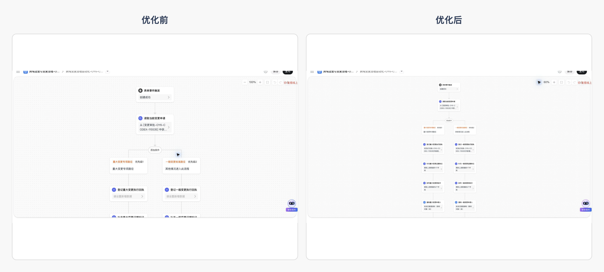
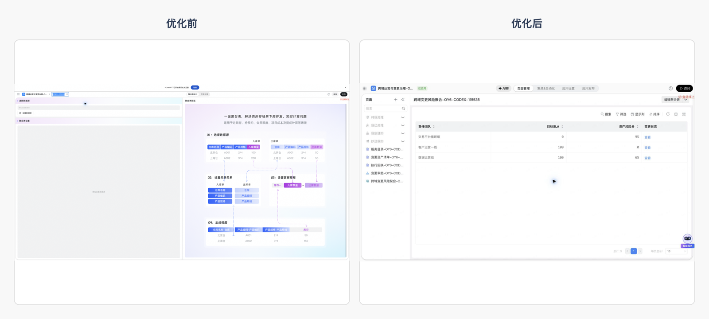
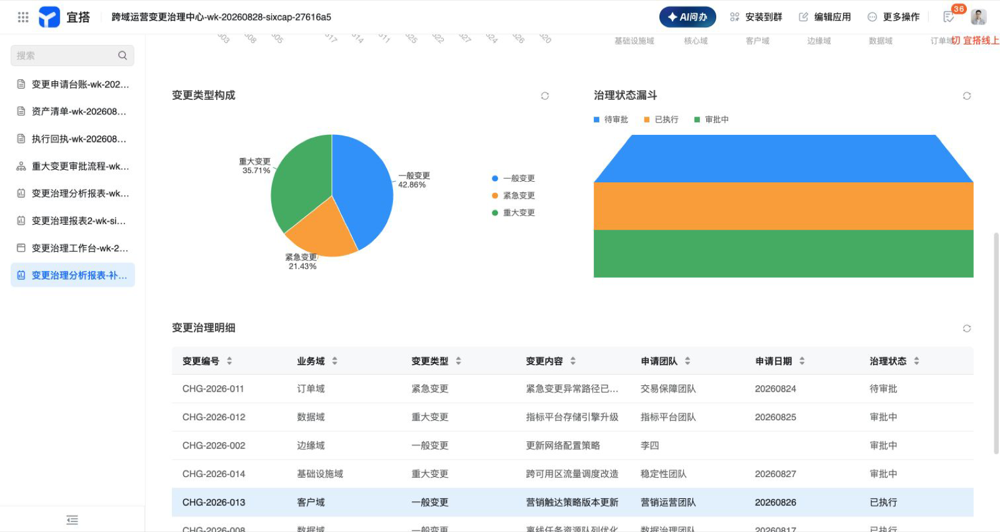

# OpenYida 本周产品体验优化汇报

**汇报日期：2026 年 8 月 28 日**

## 一、整体结论

本周围绕 OpenYida 的登录完成页、复杂审批流程、集成自动化、聚合表和原生报表进行了集中优化。过去部分页面存在“操作虽然完成，但用户看不懂”“配置像未完成”“页面空白或数据不足”等问题；优化后，关键状态更明确、业务结构更完整、数据展示更直观，已经能够支撑真实业务场景演示和阶段汇报。

> 一句话总结：OpenYida 本周把多个“成功但看不懂、配置像未完成、页面空或数据少”的体验，升级为“状态明确、数据可见、业务场景可讲”的完整产品体验。

## 二、本周优化总览

| 场景 | 一句话问题描述 | 原来现象 | 优化后现象 | 业务价值 |
|---|---|---|---|---|
| 登录完成页 | 登录完成后的反馈过于简陋 | 英文纯文本铺在空白页面中，缺少品牌、完成状态和后续提示 | 使用中文品牌化成功卡片，明确身份验证完成，并提示窗口将自动关闭 | 用户能一眼确认结果，减少“是否登录成功”的疑惑 |
| 审批流程 | 复杂业务分流表达不足 | 只有两个主要分支，部分回执配置在画布上看起来未完成 | 增加三类明确条件和默认路径，形成 25 个业务节点的完整流程 | 能覆盖重大变更、紧急变更、常规变更及兜底场景 |
| 集成自动化 | 已有配置在画布中表达不清 | 新增、更新等动作虽然已有内容，但摘要仍像“待配置” | 查询、新增、更新、消息通知等节点都能显示清晰配置摘要 | 运营人员可以直接从画布判断每一步要做什么 |
| 聚合表 | 聚合结果为空 | 设计页没有数据源和指标，运行页无法展示业务结果 | 接入两个数据源、一个关联关系和两个指标，运行页展示 3 条聚合结果 | 可直接呈现团队、目标和风险指标，支撑管理判断 |
| 原生报表 | 数据不足且出现查询异常 | 报表页提示数据查询异常，缺少可讲解的图表和明细 | 补充到 14 条业务数据，展示指标、趋势、柱状图、饼图、漏斗和明细表 | 报表从“无法展示”升级为可用于汇报的业务看板 |

## 三、登录完成页优化

登录完成页从简单英文回调文字升级为完整的中文成功界面：加入 OpenYida 品牌、成功图标、明确的完成文案以及自动关闭状态，让用户无需回到终端猜测登录结果。

| 登录完成页前后对比 |
|---|
|  |

## 四、复杂审批流程优化

流程围绕跨域运营变更场景展开，补充重大变更、紧急变更、常规变更三类明确条件和默认处理路径；各路径继续包含审批、登记、回执、证据标记和结果通知等业务环节，节点总数达到 25 个。

| 审批流程前后对比 |
|---|
|  |

## 五、集成自动化优化

集成自动化覆盖表单触发、业务数据查询、分支判断、新增回执、更新证据以及消息通知等环节。优化重点是让每个节点都能在画布上准确表达已经配置的内容，避免“明明配置过，画布仍显示待设置”的误解。

| 集成自动化前后对比 |
|---|
|  |

## 六、聚合表优化

聚合表从空白设计页升级为可直接查看结果的运行页面。当前场景以团队维度汇总目标达成和资产风险，展示 3 条聚合结果，能够直观看到责任团队、目标指标和风险值。

| 聚合表前后对比 |
|---|
|  |

## 七、原生报表优化

报表补充了 14 条业务数据，覆盖多类变更类型和业务域。页面现在可以同时展示申请总量、每日趋势、业务域负载、状态分布、处理漏斗和详细记录，既能看总体，也能下钻到具体业务明细。

| 原生报表前后对比 |
|---|
|  |

### 报表完整内容补充

## 八、业务影响

- **降低理解成本**：用户从页面本身即可判断操作是否完成、配置是否生效。
- **增强复杂场景表达**：流程和集成自动化能够承载多分支、多步骤的真实业务。
- **提升数据可见性**：聚合表和报表都从空白或异常状态升级为可直接展示业务结果。
- **改善汇报效果**：页面具备完整的结构、数据和视觉层次，可以直接用于方案演示和阶段汇报。

## 九、下一步

- 继续补充更多业务周期数据，让趋势和结构分布更有代表性。
- 结合实际运营反馈，持续优化流程分支命名和节点摘要。
- 继续关注连接器编辑场景，确保已有配置在参数调整后保持完整。
